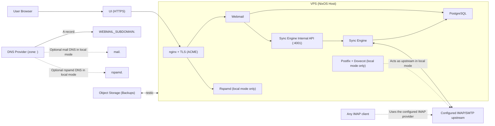

## Components

The stack has five layers:

1. **Infrastructure provisioning** (`infra/`) — Terraform modules create VPS, DNS records, and backup storage.
2. **Server configuration** (`flake.nix`, `modules/`) — NixOS declarative configuration for all services.
3. **Sync layer** (`sync-engine/`) — IMAP-to-PostgreSQL synchronization service.
4. **Web interface** (`webmail/`) — SolidStart frontend/backend for email workflows.
5. **Deploy orchestration** (`scripts/`) — installation and deployment automation.

## Deployment Modes

Homerow currently supports one configured mailbox per deployment. That mailbox can run in one of two modes:

- **`MAIL_PROVIDER_MODE=local`** — Homerow runs its bundled Postfix + Dovecot stack and the sync engine connects to that local mailbox.
- **`MAIL_PROVIDER_MODE=external`** — Homerow runs `webmail` + `sync-engine` and connects to an existing upstream IMAP/SMTP provider.

In both modes, the web UI reads mailbox state from PostgreSQL. The sync engine remains the component that talks to IMAP, and webmail write operations flow through the sync engine's internal API instead of opening IMAP/SMTP connections directly.

## Architecture Diagram

## Services and Ports

| Service | Port | Protocol | Access | Purpose |
|---------|------|----------|--------|---------|
| Webmail | 3001, 3002 | HTTP | localhost (nginx proxy) | Blue/green web UI backends |
| Sync engine internal API | 4001 | HTTP | localhost | Webmail write-path bridge to upstream mail actions |
| nginx | 80, 443 | HTTP/HTTPS | Public | Reverse proxy, TLS termination |
| PostgreSQL | 5432 | TCP | localhost | Mail index database |
| Postfix (SMTP) | 465 | TLS | Mail clients | Local-mode outgoing mail service |
| Dovecot (IMAP) | 993 | TLS | Mail clients / sync-engine | Local-mode IMAP service |
| Rspamd UI | Unix socket | HTTP | nginx proxy | Local-mode spam filter admin panel |

In `external` mode, Homerow does **not** expose its own IMAP server for third-party clients. Users connect their mail client directly to the external provider's IMAP endpoint.

## NixOS Modules

Each module in `modules/` configures one aspect of the system:

- **`configuration.nix`** — Boot loader, networking, SSH access, firewall rules, Nix store optimization.
- **`disk-config.nix`** — GPT partitioning via Disko (boot + root partitions).
- **`mail.nix`** — Optional local-mode mail stack: Postfix, Dovecot, Rspamd, ACME/TLS certificates, nginx for the Rspamd UI.
- **`backup.nix`** — Restic encrypted backups to S3 with daily schedule and retention policies.
- **`sync-engine.nix`** — PostgreSQL setup, sync engine systemd service, internal API, database schema initialization.
- **`webmail.nix`** — SolidStart app as systemd service, nginx reverse proxy with ACME, upstream IMAP/SMTP runtime configuration.
- **`settings.nix`** — Runtime settings generated from deploy configuration.
